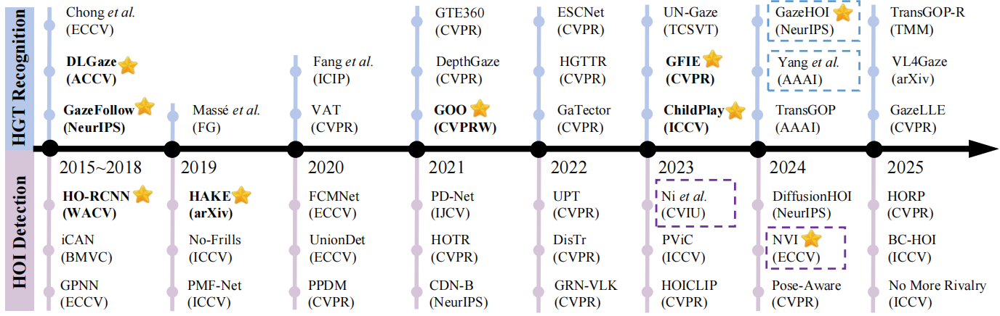
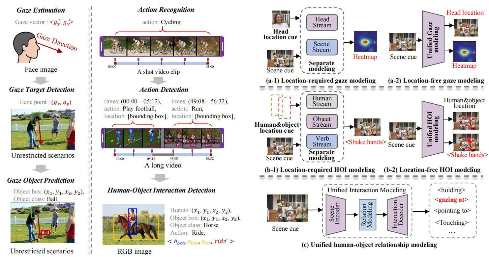
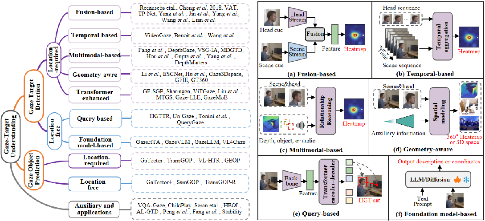
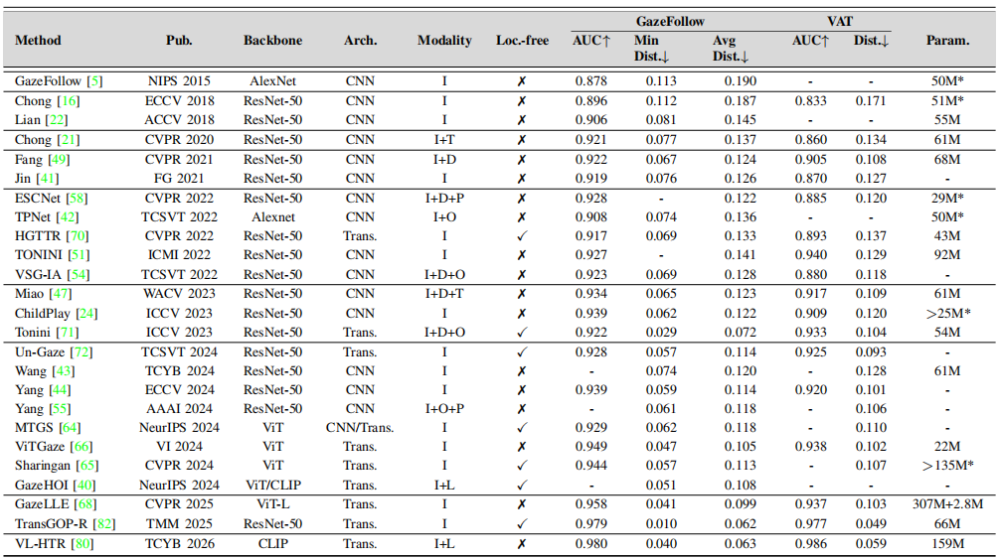
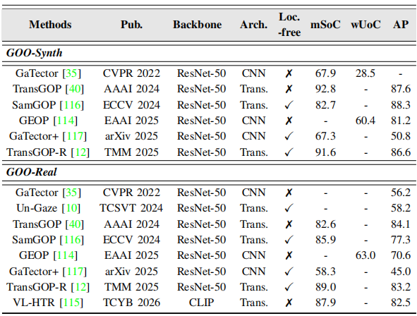
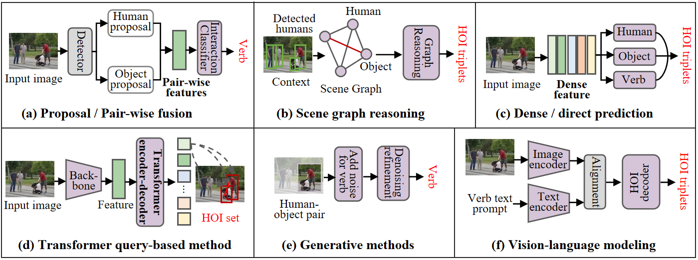
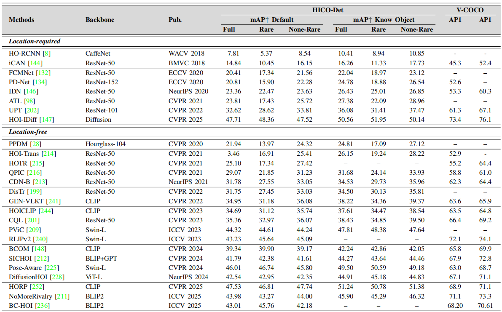
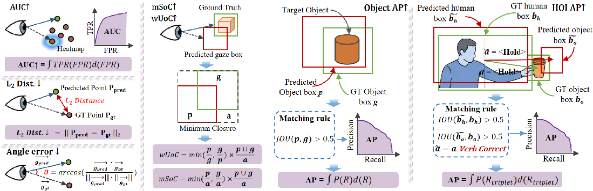

<div align="center">

# Human-Object Relationship Understanding
### From Gaze to Interaction

<p>
  <strong>A curated, survey-driven GitHub project for unified human-object relation modeling</strong><br/>
  Covering <code>Human-Gaze-Target (HGT) Recognition</code>, <code>Gaze Object Prediction (GOP)</code>, and <code>Human-Object Interaction (HOI) Detection</code>.
</p>

<p>
  
  
  
  
  
</p>

<h3>Project Team</h3>

<p>
  <strong>Yang Jin</strong><sup>1</sup> ·
  <strong>Guangyu Guo</strong><sup>2</sup> ·
  <strong>Binglu Wang</strong><sup>1&dagger;</sup>
</p>

<p>
  <sup>1</sup> School of Astronautics, Northwestern Polytechnical University, Xi’an 710072, China<br/>
  <sup>2</sup> School of Computer Science and Technology, Zhejiang University, Hangzhou 310058, China
</p>

<p>
  <em>Yang Jin and Guangyu Guo contributed equally to this work.</em><br/>
  <em>Corresponding author: Binglu Wang.</em>
</p>

<p>
  <a href="#-overview">Overview</a> •
  <a href="#-at-a-glance">At a Glance</a> •
  <a href="#-why-this-project">Why</a> •
  <a href="#-how-to-read-this-repository">How to Read</a> •
  <a href="#-taxonomy">Taxonomy</a> •
  <a href="#-benchmarks">Benchmarks</a> •
  <a href="#-evaluation">Evaluation</a> •
  <a href="#-roadmap">Roadmap</a>
</p>

</div>

---

> A unified reading hub for **attention**, **object grounding**, and **interaction reasoning** — with **GOP** as the bridge from *where humans look* to *how humans act on objects*.

## ✨ Overview

Human-Object Relationship Understanding studies how humans attend to and interact with surrounding objects in visual scenes. This repository organizes the area through three tightly connected problem settings:

- **Human-Gaze-Target (HGT) Recognition**: predicting where or what a person is looking at
- **Gaze Object Prediction (GOP)**: moving from gaze localization to object-level semantic grounding
- **Human-Object Interaction (HOI) Detection**: predicting how a person physically interacts with an object

This project is designed to serve as a **clean, visual, and research-friendly entry point** for exploring unified human-object relation modeling.

<p align="center">
  
</p>
<p align="center"><em>Chronological overview of representative methods across HGT recognition and HOI detection.</em></p>

---

## 🌟 At a Glance

| Scope | What You Can Find Here | Why It Matters |
|---|---|---|
| **Tasks** | HGT, GOP, HOI, and unified relation understanding | Connects attention modeling with interaction reasoning |
| **Content** | Taxonomies, representative papers, datasets, metrics, figures, and performance tables | Helps readers move quickly from overview to details |
| **Use Cases** | Survey reading, paper discovery, benchmark lookup, project bootstrapping | Useful for both newcomers and active researchers |

---

## 🎯 Why This Project

Most existing reviews focus on either gaze understanding or HOI detection alone. This repository instead emphasizes a unified relational perspective and makes the landscape easier to browse, compare, and extend:

- both HGT and HOI ultimately predict **structured human-object relations**
- both fields have evolved from **location-required pipelines** to **location-free, end-to-end, and semantics-aware modeling**
- **GOP** serves as a natural bridge from attentional localization to interaction-oriented reasoning

This repository is especially useful if you work on:

- gaze following
- gaze target detection
- gaze object prediction
- human-object interaction detection
- nonverbal interaction understanding
- embodied AI
- assistive robotics
- behavior analysis

---

## 🧠 Core Formulation

A unified way to describe the problem is:

```text
f : I → {<h, r, t>}
```

Where:

- `I` = input image or video
- `h` = human instance
- `t` = target entity
- `r` = relation predicate

Under this view:

- **HGT** can be seen as a special case with a fixed attentional relation such as **gazing at**
- **HOI** uses richer predicates such as **hold**, **ride**, **point to**, or **touch**
- **GOP** upgrades gaze understanding from spatial localization to object-level semantic grounding

<p align="center">
  
</p>
<p align="center"><em>From gaze to interaction: task evolution and unified human-object relationship modeling pipeline.</em></p>

---

## 🧭 How to Read This Repository

You can use this repository in several ways:

- **As a survey companion**: follow the figures, taxonomies, and benchmark summaries section by section
- **As a paper list**: expand the taxonomy blocks to browse representative methods by category
- **As a benchmark reference**: jump directly to the dataset and evaluation sections
- **As a project starter**: use the reading path, roadmap, and curated lists to build your own notes or awesome-style resources

---
## 🗂 Taxonomy

## 1. Human-Gaze-Target Recognition

<p align="center">
  
</p>
<p align="center"><em>Taxonomy of HGT recognition methods and the main modeling paradigms for HGT recognition.</em></p>

### A. Location-required HGT Detection
The target person is given in advance, usually through a head or face bounding box.

<details>
<summary><strong>Fusion-based</strong> (7 papers)</summary>

| Paper | Venue | Year |
|---|---|---:|
| [Where are they looking?](https://papers.nips.cc/paper/5848-where-are-they-looking) | NeurIPS | 2015 |
| [Connecting Gaze, Scene, and Attention: Generalized Attention Estimation via Joint Modeling of Gaze and Scene Saliency](https://doi.org/10.1007/978-3-030-01228-1_24) | ECCV | 2018 |
| [Detecting Attended Visual Targets in Video](https://openaccess.thecvf.com/content_CVPR_2020/html/Chong_Detecting_Attended_Visual_Targets_in_Video_CVPR_2020_paper.html) | CVPR | 2020 |
| [Multi-Person Gaze-Following with Numerical Coordinate Regression](https://ieeexplore.ieee.org/document/9666980) | FG | 2021 |
| [Gaze Estimation via the Joint Modeling of Multiple Cues](https://doi.org/10.1109/TCSVT.2021.3071621) | TCSVT | 2022 |
| [Dual Regression-Enhanced Gaze Target Detection in the Wild](https://doi.org/10.1109/TCYB.2023.3244269) | TCYB | 2024 |
| [Gaze Target Detection Based on Head-Local-Global Coordination](https://www.ecva.net/papers/eccv_2024/papers_ECCV/papers/03933.pdf) | ECCV | 2024 |

</details>

<details>
<summary><strong>Temporal-based</strong> (4 papers)</summary>

| Paper | Venue | Year |
|---|---|---:|
| [Following Gaze in Video](https://ieeexplore.ieee.org/document/8237422) | ICCV | 2017 |
| [Extended Gaze Following: Detecting Objects in Videos Beyond the Camera Field of View](https://ieeexplore.ieee.org/document/8756555) | FG | 2019 |
| [Patch-level Gaze Distribution Prediction for Gaze Following](https://ieeexplore.ieee.org/document/10030998) | WACV | 2023 |
| [Transition-aware Path and Direction Variation Modeling for GazeTarget Detection in Video](https://doi.org/10.1145/3799429) | TOMM | 2026 |

</details>

<details>
<summary><strong>Multimodal-based</strong> (10 papers)</summary>

| Paper | Venue | Year |
|---|---|---:|
| [Dual Attention Guided Gaze Target Detection in the Wild](https://ieeexplore.ieee.org/document/9577574) | CVPR | 2021 |
| [Depth-aware gaze-following via auxiliary networks for robotics](https://doi.org/10.1016/j.engappai.2022.104924) | EAAI | 2022 |
| [Gaze Target Estimation Inspired by Interactive Attention](https://ieeexplore.ieee.org/document/9828503) | TCSVT | 2022 |
| [Multimodal Across Domains Gaze Target Detection](https://doi.org/10.1145/3536221.3556624) | ICMI | 2022 |
| [Leveraging Multi-Modal Saliency and Fusion for Gaze Target Detection](https://proceedings.mlr.press/v226/mathew24a.html) | NeurIPS 2023 | 2023 |
| [Depth Matters: Spatial Proximity-based Gaze Cone Generation for Gaze Following in Wild](https://doi.org/10.1145/3689643) | TOMM | 2024 |
| [Exploring the Zero-Shot Capabilities of Vision-Language Models for Improving Gaze Following](https://ieeexplore.ieee.org/document/10677890) | CVPRW | 2024 |
| [Gaze Target Detection by Merging Human Attention and Activity Cues](https://doi.org/10.1609/aaai.v38i7.28480) | AAAI | 2024 |
| [Multi-Modal Gaze Following in Conversational Scenarios](https://ieeexplore.ieee.org/document/10484112) | WACV | 2024 |
| [Toward Semantic Gaze Target Detection](https://openreview.net/forum?id=BAmAFraxvf) | NeurIPS | 2024 |

</details>

<details>
<summary><strong>Geometry-aware</strong> (7 papers)</summary>

| Paper | Venue | Year |
|---|---|---:|
| [Believe It or Not, We Know What You Are Looking at!](http://arxiv.org/abs/1907.02364) | ACCV | 2018 |
| [Looking here or there? Gaze Following in 360-Degree Images](https://openaccess.thecvf.com/content/ICCV2021/papers/Li_Looking_Here_or_There_Gaze_Following_in_360-Degree_Images_ICCV_2021_paper.pdf) | ICCV | 2021 |
| [ESCNet: Gaze Target Detection with the Understanding of 3D Scenes](https://ieeexplore.ieee.org/document/9878884) | CVPR | 2022 |
| [We Know Where They Are Looking at From the RGB-D Camera: Gaze Following in 3D](https://ieeexplore.ieee.org/document/9740573) | TIM | 2022 |
| [GFIE: A Dataset and Baseline for Gaze-Following from 2D to 3D in Indoor Environments](https://ieeexplore.ieee.org/document/10204982) | CVPR | 2023 |
| [Where are they looking in the 3D space?](https://doi.org/10.1109/CVPRW59228.2023.00268) | CVPRW | 2023 |
| [GazeTarget360: Towards Gaze Target Estimation in 360-Degree for Robot Perception](https://doi.org/10.1109/IROS60139.2025.11246230) | IROS | 2025 |

</details>

<details>
<summary><strong>Transformer-enhanced</strong> (7 papers)</summary>

| Paper | Venue | Year |
|---|---|---:|
| [A Unified Model for Gaze Following and Social Gaze Prediction](https://publications.idiap.ch/attachments/papers/2024/Gupta_FG_2024.pdf) | FG | 2024 |
| [MTGS: A Novel Framework for Multi-Person Temporal Gaze Following and Social Gaze Prediction](https://proceedings.neurips.cc/paper_files/paper/2024/hash/1caf09c9f4e6b0150b06a07e77f2710c-Abstract-Conference.html) | NeurIPS | 2024 |
| [Sharingan: A Transformer Architecture for Multi-Person Gaze Following](https://ieeexplore.ieee.org/document/10658049) | CVPR | 2024 |
| [Towards Pixel-Level Prediction for Gaze Following: Benchmark and Approach](https://arxiv.org/abs/2412.00309) | arXiv | 2024 |
| [ViTGaze: Gaze Following with Interaction Features in Vision Transformers](https://doi.org/10.1007/s44267-024-00064-9) | Visual Intelligence | 2024 |
| [Gaze-LLE: Gaze Target Estimation via Large-Scale Learned Encoders](https://openaccess.thecvf.com/content/CVPR2025/papers/Ryan_Gaze-LLE_Gaze_Target_Estimation_via_Large-Scale_Learned_Encoders_CVPR_2025_paper.pdf) | CVPR | 2025 |
| [GazeMoE: Perception of Gaze Target with Mixture-of-Experts](https://arxiv.org/abs/2603.06256) | ICRA | 2026 |

</details>

---

### B. Location-free HGT Detection
The model predicts human-target gaze relations directly from the scene, without explicit head priors.

<details>
<summary><strong>Query-based Methods</strong> (4 papers)</summary>

| Paper | Venue | Year |
|---|---|---:|
| [End-to-End Human-Gaze-Target Detection with Transformers](https://ieeexplore.ieee.org/document/9879533) | CVPR | 2022 |
| [Object-aware Gaze Target Detection](https://openaccess.thecvf.com/content/ICCV2023/papers/Tonini_Object-aware_Gaze_Target_Detection_ICCV_2023_paper.pdf) | ICCV | 2023 |
| [Un-Gaze: A Unified Transformer for Joint Gaze-Location and Gaze-Object Detection](https://arxiv.org/abs/2308.13857) | TCSVT | 2023 |
| [Eye See What You See: Query-Oriented Gaze Following](https://ieeexplore.ieee.org/document/11227675) | IJCNN | 2025 |

</details>

<details>
<summary><strong>Foundation Model-based Methods</strong> (4 papers)</summary>

| Paper | Venue | Year |
|---|---|---:|
| [GazeHTA: End-to-End Gaze Target Detection with Head-Target Association](https://ieeexplore.ieee.org/document/11128763) | ICRA | 2025 |
| [GazeLLM: a plug-and-play zero-shot LLM reasoning framework for boosting gaze target detection](https://link.springer.com/article/10.1007/s44267-025-00101-1) | Visual Intelligence | 2025 |
| [GazeVLM: A Vision-Language Model for Multi-Task Gaze Understanding](https://arxiv.org/abs/2511.06348) | arXiv | 2025 |
| [VL4Gaze: Unleashing Vision-Language Models for Gaze Following](https://doi.org/10.48550/arXiv.2512.20735) | arXiv | 2026 |

</details>

---

### C. Gaze Object Prediction (GOP)
GOP extends gaze target prediction from **where someone looks** to **what object is being attended to**.

<details>
<summary><strong>Datasets and Benchmarks</strong> (2 papers)</summary>

| Paper | Venue | Year |
|---|---|---:|
| [GOO: A Dataset for Gaze Object Prediction in Retail Environments](https://ieeexplore.ieee.org/document/9523161) | CVPRW | 2021 |
| [GESCAM : A Dataset and Method on Gaze Estimation for Classroom Attention Measurement](https://doi.org/10.1109/CVPRW63382.2024.00068) | CVPRW | 2024 |

</details>

<details>
<summary><strong>Location-required GOP</strong> (4 papers)</summary>

| Paper | Venue | Year |
|---|---|---:|
| [GaTector: A Unified Framework for Gaze Object Prediction](https://ieeexplore.ieee.org/document/9879784) | CVPR | 2022 |
| [Towards Fusing Gaze Estimation and Object Prediction: What are You Looking at?](https://doi.org/10.2139/ssrn.4939643) | EAAI | 2024 |
| [TransGOP: Transformer-Based Gaze Object Prediction](https://ojs.aaai.org/index.php/AAAI/article/view/28883) | AAAI | 2024 |
| [VL-HTR: Learning Human–Target Representation From Vision–Language Model](https://doi.org/10.1109/tcyb.2026.3659335) | TCYB | 2026 |

</details>

<details>
<summary><strong>Location-free GOP</strong> (3 papers)</summary>

| Paper | Venue | Year |
|---|---|---:|
| [Boosting Gaze Object Prediction via Pixel-level Supervision from Vision Foundation Model](https://www.ecva.net/papers/eccv_2024/papers_ECCV/papers/08783.pdf) | ECCV | 2024 |
| [GaTector+: A Unified Head-free Framework for Gaze Object and Gaze Following Prediction](https://doi.org/10.48550/arXiv.2510.25301) | arXiv | 2025 |
| [TransGOP-R: Transformer-Based Real-World Gaze Object Prediction](https://ieeexplore.ieee.org/document/11275879) | TMM | 2025 |

</details>

---

### D. Auxiliary Methods and Applications

<details>
<summary><strong>Training Efficiency, Robustness, and Annotation</strong> (5 papers)</summary>

| Paper | Venue | Year |
|---|---|---:|
| [Improving Stability of Gaze Target Detection in Videos](https://ieeexplore.ieee.org/document/10312057) | IECON | 2023 |
| [AL-GTD: Deep Active Learning for Gaze Target Detection](https://doi.org/10.1145/3664647.3680952) | ACM MM | 2024 |
| [Diffusion-Refined VQA Annotations for Semi-Supervised Gaze Following](https://arxiv.org/abs/2406.02774) | ECCV | 2024 |
| [Visual Saliency Guided Gaze Target Estimation with Limited Labels](https://ieeexplore.ieee.org/document/10582000) | FG | 2024 |
| [A Plug-and-Play LLM Reasoning Module for Gaze Target Detection](https://openreview.net/forum?id=Akccupz2pP) | Visual Intelligence | 2025 |

</details>

<details>
<summary><strong>Applications and Scenario-specific Studies</strong> (5 papers)</summary>

| Paper | Venue | Year |
|---|---|---:|
| [Human Gaze Following for Human-Robot Interaction](https://ieeexplore.ieee.org/document/8593580) | IROS | 2018 |
| [Identifying Children with Autism Spectrum Disorder Based on Gaze-Following](https://ieeexplore.ieee.org/document/9190831) | ICIP | 2020 |
| [ChildPlay: A New Benchmark for Understanding Children’s Gaze Behaviour](https://doi.org/10.1109/iccv51070.2023.01914) | ICCV | 2023 |
| [HEOI: Human Attention Prediction in Natural Daily Life with Fine-Grained Human-Environment-Object Interaction Model](https://doi.org/10.1109/tip.2024.3512380) | TIP | 2024 |
| [Using Depth-Enhanced Spatial Transformation for Student Gaze Target Estimation in Dual-View Classroom Images](https://ieeexplore.ieee.org/document/10887944) | ICASSP | 2025 |

</details>

---


---

### E. Performance Snapshots for HGT and GOP

<p align="center">
  
</p>
<p align="center"><em>Representative HGT performance on GazeFollow and VAT.</em></p>

<p align="center">
  
</p>
<p align="center"><em>Representative GOP performance on GOO-Synth and GOO-Real.</em></p>

---

## 2. Human-Object Interaction Detection

<p align="center">
  
</p>
<p align="center"><em>The main modeling paradigms for HOI detection.</em></p>

### A. Location-required HOI Detection
A candidate human-object pair is provided first, and the model predicts the interaction label.

<details>
<summary><strong>Proposal / pairwise feature fusion</strong> (62 papers)</summary>

| Paper | Venue | Year | Code |
|---|---|---:|---|
| [iCAN: Instance-Centric Attention Network for Human-Object Interaction Detection](https://arxiv.org/pdf/1808.10437.pdf) | BMVC | 2018 | [Code](https://github.com/vt-vl-lab/iCAN) |
| [Detecting and Recognizing Human-Object Interactions](https://arxiv.org/abs/1704.07333) | CVPR | 2018 | — |
| [Pairwise Body-Part Attention for Recognizing Human-Object Interactions](https://openaccess.thecvf.com/content_ECCV_2018/papers/Haoshu_Fang_Pairwise_Body-Part_Attention_ECCV_2018_paper.pdf) | ECCV | 2018 | — |
| [Learning to Detect Human-Object Interactions](http://www-personal.umich.edu/~ywchao/publications/chao_wacv2018.pdf) | WACV | 2018 | [Code](https://github.com/ywchao/ho-rcnn) |
| [Turbo Learning Framework for Human-Object Interactions Recognition and Human Pose Estimation](https://arxiv.org/pdf/1903.06355.pdf) | AAAI | 2019 | — |
| [Transferable Interactiveness Knowledge for Human-Object Interaction Detection](https://arxiv.org/pdf/1811.08264.pdf) | CVPR | 2019 | [Code](https://github.com/DirtyHarryLYL/Transferable-Interactiveness-Network) |
| [Detecting Unseen Visual Relations Using Analogies](https://www.di.ens.fr/willow/research/analogy/paper.pdf) | ICCV | 2019 | [Code](https://github.com/jpeyre/analogy) |
| [No-Frills Human-Object Interaction Detection: Factorization, Layout Encodings, and Training Techniques](http://tanmaygupta.info/assets/img/no_frills/paper.pdf) | ICCV | 2019 | [Code](https://github.com/BigRedT/no_frills_hoi_det) |
| [Pose-Aware Multi-Level Feature Network for Human Object Interaction Detection](https://arxiv.org/abs/1909.08453) | ICCV | 2019 | [Code](https://github.com/bobwan1995/PMFNet) |
| [Relation Parsing Neural Network for Human-Object Interaction Detection](http://openaccess.thecvf.com/content_ICCV_2019/papers/Zhou_Relation_Parsing_Neural_Network_for_Human-Object_Interaction_Detection_ICCV_2019_paper.pdf) | ICCV | 2019 | — |
| [Detecting Human-Object Interactions via Functional Generalization](https://arxiv.org/pdf/1904.03181.pdf) | AAAI | 2020 | — |
| [Cascaded Human-Object Interaction Recognition](https://arxiv.org/pdf/2003.04262.pdf) | CVPR | 2020 | [Code](https://github.com/tfzhou/C-HOI) |
| [Detailed 2D-3D Joint Representation for Human-Object Interaction](https://arxiv.org/pdf/2004.08154.pdf) | CVPR | 2020 | [Code](https://github.com/DirtyHarryLYL/DJ-RN) |
| [Discovering Human Interactions with Novel Objects via Zero-Shot Learning](https://cse.buffalo.edu/~jsyuan/papers/2020/05225.pdf) | CVPR | 2020 | [Code](https://github.com/scwangdyd/zero_shot_hoi) |
| [PaStaNet: Toward Human Activity Knowledge Engine](https://arxiv.org/pdf/2004.00945.pdf) | CVPR | 2020 | [Code](https://github.com/DirtyHarryLYL/HAKE-Action/tree/Instance-level-HAKE-Action) |
| [Amplifying Key Cues for Human-Object-Interaction Detection](http://www.ecva.net/papers/eccv_2020/papers_ECCV/papers/123590239.pdf) | ECCV | 2020 | — |
| [Detecting Human-Object Interactions with Action Co-occurrence Priors](https://arxiv.org/pdf/2007.08728.pdf) | ECCV | 2020 | [Code](https://github.com/Dong-JinKim/ActionCooccurrencePriors/) |
| PD-Net: Polysemy Deciphering Network for Human-Object Interaction Detection | ECCV | 2020 | [Code](https://github.com/MuchHair/PD-Net) |
| [Visual Compositional Learning for Human-Object Interaction Detection](https://arxiv.org/pdf/2007.12407.pdf) | ECCV | 2020 | [Code](https://github.com/zhihou7/VCL) |
| [Skeleton-Based Interactive Graph Network For Human Object Interaction Detection](https://ieeexplore.ieee.org/ielx7/9099125/9102711/09102755.pdf) | ICME | 2020 | — |
| Interact as You Intend: Intention-Driven Human-Object Interaction Detection | TMM | 2020 | — |
| [Pose-Based Modular Network for Human-Object Interaction Detection](https://arxiv.org/pdf/2008.02042.pdf) | arXiv | 2020 | [Code](https://github.com/birlrobotics/PMN) |
| [Human-Object Interaction Detection via Weak Supervision](https://arxiv.org/pdf/2112.00492.pdf) | BMVC | 2021 | — |
| [Towards Overcoming False Positives in Visual Relationship Detection](https://arxiv.org/pdf/2012.12510.pdf) | BMVC | 2021 | — |
| Detecting Human–Object Interaction with Multi-Level Pairwise Feature Network | CVMJ | 2021 | — |
| [Affordance Transfer Learning for Human-Object Interaction Detection](https://arxiv.org/pdf/2104.02867.pdf) | CVPR | 2021 | [Code](https://github.com/zhihou7/HOI-CL) |
| [Detecting Human-Object Interaction via Fabricated Compositional Learning](https://arxiv.org/pdf/2103.08214.pdf) | CVPR | 2021 | [Code](https://github.com/zhihou7/FCL) |
| [Discovering Human Interactions with Large-Vocabulary Objects via Query and Multi-Scale Detection](https://cse.buffalo.edu/~jsyuan/papers/2021/ICCV2021_sucheng.pdf) | ICCV | 2021 | [Code](https://github.com/scwangdyd/large_vocabulary_hoi_detection) |
| Improved Human-Object Interaction Detection Through On-the-Fly Stacked Generalization | IEEE Access | 2021 | — |
| Semantic Recognition of Human-Object Interactions via Gaussian-Based Elliptical Modeling and Pixel-Level Labeling | IEEE Access | 2021 | — |
| Polysemy Deciphering Network for Robust Human–Object Interaction Detection | IJCV | 2021 | — |
| [Human–object interaction detection with missing objects](https://www.sciencedirect.com/science/article/pii/S0262885621001670?via%3Dihub#tbl0005) | IVC | 2021 | — |
| [ACP++: Action Co-occurrence Priors for Human-Object Interaction Detection](https://arxiv.org/pdf/2109.04047.pdf) | TIP | 2021 | [Code](https://github.com/Dong-JinKim/ActionCooccurrencePriors/) |
| Few-Shot Human-Object Interaction Recognition With Semantic-Guided Attentive Prototypes Network | TIP | 2021 | — |
| [Hierarchical Reasoning Network for Human-Object Interaction Detection](https://ieeexplore.ieee.org/stamp/stamp.jsp?tp=&arnumber=9552553) | TIP | 2021 | — |
| Learning Human-Object Interaction via Interactive Semantic Reasoning | TIP | 2021 | — |
| [Transferable Interactiveness Knowledge for Human-Object Interaction Detection](https://arxiv.org/pdf/2101.10292.pdf) | TPAMI | 2021 | [Code](https://github.com/DirtyHarryLYL/Transferable-Interactiveness-Network) |
| [Detecting Human-Object Interaction with Mixed Supervision](https://arxiv.org/pdf/2011.04971v1.pdf) | WACV | 2021 | — |
| [Highlighting Object Category Immunity for the Generalization of Human-Object Interaction Detection](https://arxiv.org/pdf/2202.09492.pdf) | AAAI | 2022 | [Code](https://github.com/Foruck/OC-Immunity) |
| [Distance Matters in Human-Object Interaction Detection](https://arxiv.org/pdf/2207.01869.pdf) | ACMMM | 2022 | — |
| [Distillation Using Oracle Queries for Transformer-Based Human-Object Interaction Detection](https://openaccess.thecvf.com/content/CVPR2022/papers/Qu_Distillation_Using_Oracle_Queries_for_Transformer-Based_Human-Object_Interaction_Detection_CVPR_2022_paper.pdf) | CVPR | 2022 | [Code](https://github.com/SherlockHolmes221/DOQ) |
| [Exploring Structure-Aware Transformer over Interaction Proposals for Human-Object Interaction Detection](https://openaccess.thecvf.com/content/CVPR2022/papers/Zhang_Exploring_Structure-Aware_Transformer_Over_Interaction_Proposals_for_Human-Object_Interaction_Detection_CVPR_2022_paper.pdf) | CVPR | 2022 | — |
| [Interactiveness Field in Human-Object Interactions](https://arxiv.org/pdf/2204.07718.pdf) | CVPR | 2022 | [Code](https://github.com/Foruck/Interactiveness-Field) |
| [Chairs Can be Stood on: Overcoming Object Bias in Human-Object Interaction Detection](https://arxiv.org/pdf/2207.02400.pdf) | ECCV | 2022 | — |
| [Discovering Human-Object Interaction Concepts via Self-Compositional Learning](https://arxiv.org/pdf/2203.14272.pdf) | ECCV | 2022 | [Code](https://github.com/zhihou7/HOI-CL) |
| [HQM: Hard Positive Query Mining for DETR-based Human-Object Interaction Detection](https://arxiv.org/pdf/2207.05293.pdf) | ECCV | 2022 | [Code](https://github.com/MuchHair/HQM) |
| [Mining Cross-Person Cues for Body-Part Interactiveness Learning in HOI Detection](https://arxiv.org/pdf/2207.14192v1.pdf) | ECCV | 2022 | [Code](https://github.com/enlighten0707/Body-Part-Map-for-Interactiveness) |
| [Multi-Scale Human-Object Interaction Detector](https://ieeexplore.ieee.org/stamp/stamp.jsp?arnumber=9927451) | TCSVT | 2022 | — |
| Transferable Interactiveness Knowledge for Human-Object Interaction Detection | TPAMI | 2022 | — |
| [Effective Actor-centric Human-object Interaction Detection](https://arxiv.org/pdf/2202.11998.pdf) | arXiv | 2022 | — |
| [Knowledge Guided Bidirectional Attention Network for Human-Object Interaction Detection](https://arxiv.org/pdf/2207.07979.pdf) | arXiv | 2022 | — |
| [Learning from easy to hard pairs: Multi-step reasoning network for human-object interaction detection](https://dl.acm.org/doi/10.1145/3581783.3612581) | ACMMM | 2023 | — |
| [Parallel Disentangling Network for Human-Object Interaction Detection](https://www.sciencedirect.com/science/article/pii/S0031320323007185?via%3Dihub) | ICV | 2023 | — |
| SSRT: A Sequential Skeleton RGB Transformer to Recognize Fine-Grained Human-Object Interactions and Action Recognition | IEEE Access | 2023 | — |
| Exploring Spatio–Temporal Graph Convolution for Video-Based Human–Object Interaction Recognition | TCSVT | 2023 | — |
| Effects of Motion-Relevant Knowledge From Unlabeled Video to Human–Object Interaction Detection | TNNLS | 2023 | — |
| [PR-Net: Parallel Reasoning Network for Human-Object Interaction Detection](https://arxiv.org/pdf/2301.03510.pdf) | arXiv | 2023 | — |
| [Bilateral Adaptation for Human-Object Interaction Detection with Occlusion-Robustness](https://openaccess.thecvf.com/content/CVPR2024/papers/Wang_Bilateral_Adaptation_for_Human-Object_Interaction_Detection_with_Occlusion-Robustness_CVPR_2024_paper.pdf) | CVPR | 2024 | — |
| Geometric Features Enhanced Human–Object Interaction Detection | TIM | 2024 | — |
| Semantic-Aware Dynamic Generation Networks for Few-Shot Human–Object Interaction Recognition | TNNLS | 2024 | — |
| PPDM++: Parallel Point Detection and Matching for Fast and Accurate HOI Detection | TPAMI | 2024 | — |
| Bridging Detection Architectures With Foundation Models: A Unified Framework for Human–Object Interaction Detection | IEEE Access | 2026 | — |

</details>

<details>
<summary><strong>Scene graph reasoning</strong> (22 papers)</summary>

| Paper | Venue | Year | Code |
|---|---|---:|---|
| [Learning Human-Object Interactions by Graph Parsing Neural Networks](https://arxiv.org/pdf/1808.07962.pdf) | ECCV | 2018 | [Code](https://github.com/SiyuanQi/gpnn) |
| [Deep Contextual Attention for Human-Object Interaction Detection](http://openaccess.thecvf.com/content_ICCV_2019/papers/Wang_Deep_Contextual_Attention_for_Human-Object_Interaction_Detection_ICCV_2019_paper.pdf) | ICCV | 2019 | — |
| [ConsNet: Learning Consistency Graph for Zero-Shot Human-Object Interaction Detection](https://arxiv.org/pdf/2008.06254.pdf) | ACMMM | 2020 | [Code](https://github.com/yeliudev/ConsNet) |
| [VSGNet: Spatial Attention Network for Detecting Human Object Interactions Using Graph Convolutions](https://arxiv.org/pdf/2003.05541.pdf) | CVPR | 2020 | [Code](https://github.com/ASMIftekhar/VSGNet) |
| [Contextual Heterogeneous Graph Network for Human-Object Interaction Detection](http://www.ecva.net/papers/eccv_2020/papers_ECCV/papers/123620239.pdf) | ECCV | 2020 | — |
| [DRG: Dual Relation Graph for Human-Object Interaction Detection](http://www.ecva.net/papers/eccv_2020/papers_ECCV/papers/123570681.pdf) | ECCV | 2020 | [Code](https://github.com/vt-vl-lab/DRG) |
| [A Graph-based Interactive Reasoning for Human-Object Interaction Detection](https://www.ijcai.org/Proceedings/2020/155) | IJCAI | 2020 | — |
| [Action-Guided Attention Mining and Relation Reasoning Network for Human-Object Interaction Detection](https://www.ijcai.org/Proceedings/2020/0154.pdf) | IJCAI | 2020 | — |
| [Zero-Shot Human-Object Interaction Recognition via Affordance Graphs](https://arxiv.org/pdf/2009.01039.pdf) | arXiv | 2020 | — |
| [SG2HOI: Exploiting Scene Graphs for Human-Object Interaction Detection](https://arxiv.org/pdf/2311.01755.pdf) | ICCV | 2021 | — |
| [Spatially Conditioned Graphs for Detecting Human–Object Interactions](https://arxiv.org/pdf/2012.06060.pdf) | ICCV | 2021 | [Code](https://github.com/fredzzhang/spatially-conditioned-graphs) |
| [RR-Net: Injecting Interactive Semantics in Human-Object Interaction Detection](https://arxiv.org/pdf/2104.15015.pdf) | IJCAI | 2021 | — |
| IPGN: Interactiveness Proposal Graph Network for Human-Object Interaction Detection | TIP | 2021 | — |
| [Human Object Interaction Detection using Two-Direction Spatial Enhancement and Exclusive Object Prior](https://arxiv.org/pdf/2105.03089.pdf) | PR | 2022 | — |
| DGIG-Net: Dynamic Graph-in-Graph Networks for Few-Shot Human–Object Interaction | TCYB | 2022 | — |
| Cascaded Parsing of Human-Object Interaction Recognition | TPAMI | 2022 | — |
| Task-Oriented High-Order Context Graph Networks for Few-Shot Human-Object Interaction Recognition | TSMCS | 2022 | — |
| Parallel Multi-Head Graph Attention Network Model for Human-Object Interaction Detection | IEEE Access | 2023 | — |
| [Human-Object Interaction Detection via Global Context and Pairwise-level Fusion Features Integration Network](https://www.sciencedirect.com/science/article/pii/S0893608023006251?via%3Dihub#fig1) | IVC | 2023 | — |
| Toward a Unified Transformer-Based Framework for Scene Graph Generation and Human-Object Interaction Detection | TIP | 2023 | — |
| [TMHOI: Translational Model for Human-Object Interaction Detection](https://arxiv.org/pdf/2303.04253.pdf) | arXiv | 2023 | — |
| ASK-HOI: Affordance-Scene Knowledge Prompting for Human-Object Interaction Detection | TMM | 2026 | — |

</details>

<details>
<summary><strong>Vision-language modeling</strong> (9 papers)</summary>

| Paper | Venue | Year | Code |
|---|---|---:|---|
| [Scaling Human-Object Interaction Recognition through Zero-Shot Learning](http://vision.stanford.edu/pdf/shen2018wacv.pdf) | WACV | 2018 | — |
| [Diagnosing Rarity in Human-Object Interaction Detection](https://arxiv.org/pdf/2006.05728.pdf) | CVPRW | 2020 | — |
| [Novel Human-Object Interaction Detection via Adversarial Domain Generalization](https://arxiv.org/pdf/2005.11406.pdf) | arXiv | 2020 | — |
| [Exploiting CLIP for Zero-shot HOI Detection Requires Knowledge Distillation at Multiple Levels](https://arxiv.org/pdf/2309.05069.pdf) | WACV | 2023 | [Code](https://github.com/bobwan1995/Zeroshot-HOI-with-CLIP) |
| [Exploiting CLIP for Zero-shot HOI Detection Requires Knowledge Distillation at Multiple Levels](https://arxiv.org/pdf/2309.05069.pdf) | arXiv | 2023 | [Code](https://github.com/bobwan1995/Zeroshot-HOI-with-CLIP) |
| [Exploring Conditional Multi-Modal Prompts for Zero-shot HOI Detection](https://arxiv.org/pdf/2408.02484) | ECCV | 2024 | [Code](https://github.com/ltttpku/CMMP) |
| Learning Self- and Cross-Triplet Context Clues for Human-Object Interaction Detection | TCSVT | 2024 | — |
| [Diagnosing Human-object Interaction Detectors](https://arxiv.org/pdf/2308.08529.pdf) | IJCV | 2025 | [Code](https://github.com/neu-vi/Diag-HOI) |
| Interaction Is Worth More Explanations: Improving Human–Object Interaction Representation With Propositional Knowledge | TCDS | 2025 | — |

</details>

<details>
<summary><strong>Query-based Transformer methods</strong> (1 papers)</summary>

| Paper | Venue | Year | Code |
|---|---|---:|---|
| [HODN: Disentangling Human-Object Feature for HOI Detection](https://arxiv.org/pdf/2308.10158.pdf) | TMM | 2023 | [Code](https://github.com/fangshuman/HODN) |

</details>

---

### B. Location-free HOI Detection
The model predicts complete `<human, interaction, object>` triplets directly from the image.

<details>
<summary><strong>Dense triplet prediction</strong> (16 papers)</summary>

| Paper | Venue | Year | Code |
|---|---|---:|---|
| [Learning Human-Object Interaction Detection Using Interaction Points](https://arxiv.org/pdf/2003.14023.pdf) | CVPR | 2020 | [Code](https://github.com/vaesl/IP-Net) |
| [PPDM: Parallel Point Detection and Matching for Real-time Human-Object Interaction Detection](https://arxiv.org/pdf/1912.12898.pdf) | CVPR | 2020 | [Code](https://github.com/YueLiao/PPDM) |
| [Classifying All Interacting Pairs in a Single Shot](https://arxiv.org/pdf/2001.04360.pdf) | WACV | 2020 | — |
| DIRV: Dense Interaction Region Voting for End-to-End Human-Object Interaction Detection | AAAI | 2021 | — |
| [Glance and Gaze: Inferring Action-Aware Points for One-Stage Human-Object Interaction Detection](https://arxiv.org/pdf/2104.05269.pdf) | CVPR | 2021 | [Code](https://github.com/SherlockHolmes221/GGNet) |
| [Iwin: Human-Object Interaction Detection via Transformer with Irregular Windows](https://arxiv.org/pdf/2203.10537.pdf) | ECCV | 2022 | — |
| Spatial-Net for Human-Object Interaction Detection | IEEE Access | 2022 | — |
| RR-Net: Relation Reasoning for End-to-End Human-Object Interaction Detection | TCSVT | 2022 | — |
| DSSF: Dynamic Semantic Sampling and Fusion for One-Stage Human–Object Interaction Detection | TIM | 2022 | — |
| [Improving Human-Object Interaction Detection via Virtual Image Learning](https://arxiv.org/pdf/2308.02606.pdf) | ACMMM | 2023 | — |
| [UnionDet: Union-Level Detector Towards Real-Time Human-Object Interaction Detection](https://arxiv.org/pdf/2312.12664.pdf) | ECCV | 2023 | — |
| [Efficient Adaptive Human-Object Interaction Detection with Concept-guided Memory](https://arxiv.org/pdf/2309.03696.pdf) | ICCV | 2023 | [Code](https://github.com/ltttpku/ADA-CM) |
| [Exploring Predicate Visual Context in Detecting Human-Object Interactions](https://arxiv.org/pdf/2308.06202.pdf) | ICCV | 2023 | [Code](https://github.com/fredzzhang/pvic) |
| [Neural-Logic Human-Object Interaction Detection](https://openreview.net/pdf?id=QjI36zxjbW) | NeurIPS | 2023 | [Code](https://github.com/weijianan1/LogicHOI) |
| [Exploring Self- and Cross-Triplet Correlations for Human-Object Interaction Detection](https://arxiv.org/pdf/2401.05676.pdf) | AAAI | 2024 | — |
| [Focusing on what to decode and what to train: SOV Decoding with Specific Target Guided DeNoising and Vision Language Advisor](https://arxiv.org/pdf/2307.02291.pdf) | WACV | 2025 | [Code](https://github.com/cjw2021/SOV-STG) |

</details>

<details>
<summary><strong>Query-based Transformer methods</strong> (30 papers)</summary>

| Paper | Venue | Year | Code |
|---|---|---:|---|
| [End-to-End Human Object Interaction Detection with HOI Transformer](https://arxiv.org/pdf/2103.04503.pdf) | CVPR | 2021 | [Code](https://github.com/bbepoch/HoiTransformer) |
| [HOTR: End-to-End Human-Object Interaction Detection with Transformers](https://arxiv.org/pdf/2104.13682.pdf) | CVPR | 2021 | [Code](https://github.com/kakaobrain/HOTR) |
| [QPIC: Query-Based Pairwise Human-Object Interaction Detection with Image-Wide Contextual Information](https://arxiv.org/pdf/2103.05399.pdf) | CVPR | 2021 | [Code](https://github.com/hitachi-rd-cv/qpic) |
| [Reformulating HOI Detection as Adaptive Set Prediction](https://arxiv.org/pdf/2103.05983.pdf) | CVPR | 2021 | [Code](https://github.com/yoyomimi/AS-Net) |
| [Visual Relationship Detection Using Part-and-Sum Transformers with Composite Queries](https://arxiv.org/pdf/2105.02170.pdf) | ICCV | 2021 | — |
| [Mining the Benefits of Two-stage and One-stage HOI Detection](https://arxiv.org/pdf/2108.05077.pdf) | NeurIPS | 2021 | [Code](https://github.com/YueLiao/CDN) |
| [Improving Human-Object Interaction Detection via Phrase Learning and Label Composition](https://arxiv.org/pdf/2112.07383.pdf) | AAAI | 2022 | — |
| [CATN: Category-Aware Transformer Network for Human-Object Interaction Detection](https://arxiv.org/pdf/2204.04911.pdf) | CVPR | 2022 | — |
| [Efficient Two-Stage Detection of Human–Object Interactions with a Novel Unary–Pairwise Transformer](https://arxiv.org/pdf/2112.01838.pdf) | CVPR | 2022 | [Code](https://github.com/fredzzhang/upt) |
| [Human-Object Interaction Detection via Disentangled Transformer](https://arxiv.org/pdf/2204.09290.pdf) | CVPR | 2022 | — |
| [MSTR: Multi-Scale Transformer for Human-Object Interaction Detection](https://arxiv.org/pdf/2203.14709.pdf) | CVPR | 2022 | — |
| [What to look at and where: Semantic and Spatial Refined Transformer for detecting human-object interactions](https://arxiv.org/pdf/2204.00746.pdf) | CVPR | 2022 | — |
| [Category Query Learning for Human-Object Interaction Classification](https://arxiv.org/pdf/2303.14005.pdf) | CVPR | 2023 | [Code](https://github.com/charles-xie/CQL) |
| [MUREN: Multiple Relation Network for Human-Object Interaction Detection](https://arxiv.org/pdf/2304.04997.pdf) | CVPR | 2023 | [Code](http://cvlab.postech.ac.kr/research/MUREN/) |
| [Agglomerative Transformer for Human-Object Interaction Detection](https://arxiv.org/pdf/2308.08370.pdf) | ICCV | 2023 | [Code](https://github.com/six6607/AGER) |
| ERNet: An Efficient and Reliable Human-Object Interaction Detection Network | TIP | 2023 | — |
| Point-Based Learnable Query Generator for Human–Object Interaction Detection | TIP | 2023 | — |
| [Disentangled Interaction Representation for One-Stage Human-Object Interaction Detection](https://arxiv.org/pdf/2312.01713.pdf) | arXiv | 2023 | — |
| [Discovering Syntactic Interaction Clues for Human-Object Interaction Detection](https://openaccess.thecvf.com/content/CVPR2024/papers/Luo_Discovering_Syntactic_Interaction_Clues_for_Human-Object_Interaction_Detection_CVPR_2024_paper.pdf) | CVPR | 2024 | — |
| [Disentangled Pre-training for Human-Object Interaction Detection](https://arxiv.org/pdf/2404.01725.pdf) | CVPR | 2024 | [Code](https://github.com/xingaoli/DP-HOI) |
| [Exploring Pose-Aware Human-Object Interaction via Hybrid Learning](https://openaccess.thecvf.com/content/CVPR2024/papers/Wu_Exploring_Pose-Aware_Human-Object_Interaction_via_Hybrid_Learning_CVPR_2024_paper.pdf) | CVPR | 2024 | — |
| Enhanced Human–Object Interaction Detection via Maximum IoU Partitioning and Chunk Block Attention | IEEE Access | 2024 | — |
| Zero-Shot Human–Object Interaction Detection via Similarity Propagation | TNNLS | 2024 | — |
| [FGAHOI: Fine-Grained Anchors for Human-Object Interaction Detection](https://arxiv.org/pdf/2301.04019.pdf) | TPAMI | 2024 | [Code](https://github.com/xiaomabufei/FGAHOI) |
| [No More Sibling Rivalry: Debiasing Human-Object Interaction Detection](https://arxiv.org/pdf/2509.00760) | ICCV | 2025 | [Code](https://github.com/YangBin55/No-More-Sibling-Rivalry) |
| [Learning Human-Object Interaction as Groups](https://arxiv.org/pdf/2510.18357) | NeurIPS | 2025 | — |
| Interaction-Aware Transformer Network for Human-Object Interaction Detection | TCYB | 2025 | — |
| Synergistic Prompting Learning for Human-Object Interaction Detection | TIP | 2025 | — |
| [DQEN: Dual Query Enhancement Network for DETR-based HOI Detection](https://arxiv.org/pdf/2508.18896) | arXiv | 2025 | [Code](https://github.com/lzzhhh1019/DQEN) |
| [QueryCraft: Transformer-Guided Query Initialization for Enhanced Human-Object Interaction Detection](https://arxiv.org/pdf/2508.08590) | AAAI | 2026 | [Code](https://github.com/YuxiaoWang-AI/QueryCraft) |

</details>

<details>
<summary><strong>Generative modeling</strong> (4 papers)</summary>

| Paper | Venue | Year | Code |
|---|---|---:|---|
| [Boosting Human-Object Interaction Detection with Text-to-Image Diffusion Model](https://arxiv.org/pdf/2305.12252.pdf) | arXiv | 2023 | — |
| [A Plug-and-Play Method for Rare Human-Object Interactions Detection by Bridging Domain Gap](https://arxiv.org/pdf/2407.21438) | ACMMM | 2024 | [Code](https://github.com/LijunZhang01/CEFA) |
| [Human-Object Interaction Detection Collaborated with Large Relation-driven Diffusion Models](https://arxiv.org/pdf/2410.20155) | NeurIPS | 2024 | [Code](https://github.com/0liliulei/DiffusionHOI) |
| [CycleHOI: Improving Human-Object Interaction Detection with Cycle Consistency of Detection and Generation](https://arxiv.org/pdf/2407.11433) | arXiv | 2024 | — |

</details>

<details>
<summary><strong>Vision-language modeling</strong> (22 papers)</summary>

| Paper | Venue | Year | Code |
|---|---|---:|---|
| [GEN-VLKT: Simplify Association and Enhance Interaction Understanding for HOI Detection](https://arxiv.org/pdf/2203.13954.pdf) | CVPR | 2022 | [Code](https://github.com/YueLiao/) |
| [Learning Transferable Human-Object Interaction Detector with Natural Language Supervision](https://cse.buffalo.edu/~jsyuan/papers/2022/CVPR2022_4126.pdf) | CVPR | 2022 | [Code](https://github.com/scwangdyd/promting_hoi) |
| [RLIP: Relational Language-Image Pre-training for Human-Object Interaction Detection](https://arxiv.org/pdf/2209.01814.pdf) | NeurIPS | 2022 | [Code](https://github.com/JacobYuan7/RLIP) |
| [End-to-End Zero-Shot HOI Detection via Vision and Language Knowledge Distillation](https://arxiv.org/pdf/2204.03541.pdf) | AAAI | 2023 | [Code](https://github.com/mrwu-mac/EoID) |
| [HOICLIP: Efficient Knowledge Transfer for HOI Detection with CLIP](https://arxiv.org/pdf/2303.15786.pdf) | CVPR | 2023 | [Code](https://github.com/Artanic30/HOICLIP) |
| [Open-Category Human-Object Interaction Pre-Training via Language Modeling Framework](https://openaccess.thecvf.com/content/CVPR2023/papers/Zheng_Open-Category_Human-Object_Interaction_Pre-Training_via_Language_Modeling_Framework_CVPR_2023_paper.pdf) | CVPR | 2023 | — |
| [ViPLO: Vision Transformer-based Patch-aligned HOI Localization](https://arxiv.org/pdf/2304.08114.pdf) | CVPR | 2023 | [Code](https://github.com/Jeeseung-Park/ViPLO) |
| [RLIPv2: Fast Scaling of Relational Language-Image Pre-training](https://arxiv.org/pdf/2308.09351.pdf) | ICCV | 2023 | [Code](https://github.com/JacobYuan7/RLIPv2) |
| [Unified Visual Relationship Detection with Vision and Language Models](https://arxiv.org/pdf/2303.08998.pdf) | ICCV | 2023 | — |
| [Weakly-supervised HOI Detection via Prior-guided Bi-level Representation Learning](https://arxiv.org/pdf/2303.01313.pdf) | ICLR | 2023 | [Code](https://github.com/bobwan1995/Weakly-HOI) |
| [CLIP4HOI: Adapting CLIP for Open-Vocabulary Human-Object Interaction Detection](https://openreview.net/pdf?id=nqIIWnwe73) | NeurIPS | 2023 | — |
| [Detecting Any Human-Object Interaction Relationship: Universal HOI Detector with Spatial Prompt Learning on Foundation Models](https://arxiv.org/pdf/2311.03799.pdf) | NeurIPS | 2023 | [Code](https://github.com/Caoyichao/UniHOI) |
| [Dual-Prior Augmented Decoding Network for Long Tail Distribution in HOI Detection](https://ojs.aaai.org/index.php/AAAI/article/view/27949) | AAAI | 2024 | [Code](https://github.com/PRIS-CV/DPADN) |
| [Exploring the Potential of Large Foundation Models for Open-Vocabulary HOI Detection](https://arxiv.org/pdf/2404.06194.pdf) | CVPR | 2024 | [Code](https://github.com/ltttpku/CMD-SE-release) |
| [Open-World Human-Object Interaction Detection via Multi-modal Prompts](https://arxiv.org/pdf/2406.07221) | CVPR | 2024 | [Code](https://mp-hoi.github.io/) |
| [Towards Zero-shot Human-Object Interaction Detection via Vision-Language Integration](https://arxiv.org/pdf/2403.07246.pdf) | NN | 2024 | — |
| [EZ-HOI: VLM Adaptation via Guided Prompt Learning for Zero-Shot HOI Detection](https://arxiv.org/pdf/2410.23904) | NeurIPS | 2024 | [Code](https://github.com/ChelsieLei/EZ-HOI) |
| [Bilateral Collaboration with Large Vision-Language Models for Open Vocabulary Human-Object Interaction Detection](https://arxiv.org/pdf/2507.06510) | ICCV | 2025 | [Code](https://github.com/MPI-Lab/BC-HOI) |
| [HOLa: Zero-Shot HOI Detection with Low-Rank Decomposed VLM Feature Adaptation](https://arxiv.org/pdf/2507.15542) | ICCV | 2025 | [Code](https://github.com/ChelsieLei/HOLa) |
| [Open-Vocabulary HOI Detection with Interaction-aware Prompt and Concept Calibration](https://arxiv.org/pdf/2508.03207) | ICCV | 2025 | [Code](https://github.com/ltttpku/INP-CC) |
| [CL-HOI: Cross-Level Human-Object Interaction Distillation from Vision Large Language Models](https://arxiv.org/pdf/2410.15657) | KBS | 2025 | — |
| [Dynamic Scene Understanding from Vision-Language Representations](https://arxiv.org/pdf/2501.11653) | arXiv | 2025 | [Code](https://tau-vailab.github.io/Dynamic-Scene-Understanding/) |

</details>

<details>
<summary><strong>Proposal / pairwise feature fusion</strong> (2 papers)</summary>

| Paper | Venue | Year | Code |
|---|---|---:|---|
| Human–Object Interaction Detection via Global Context and Pairwise-Level Fusion Features Integration | Neural Networks | 2024 | [Code](https://github.com/ddwhzh/GFIN) |
| [Geometric Features Enhanced Human-Object Interaction Detection](https://arxiv.org/pdf/2406.18691) | TIM | 2024 | [Code](https://github.com/zhumanli/GeoHOI) |

</details>

---


---

### C. Performance Snapshot for HOI

<p align="center">
  
</p>
<p align="center"><em>Representative HOI detection performance on HICO-Det and V-COCO.</em></p>

---

## 3. Bridging from Gaze to Interaction

Three important directions define this transition:

### From auxiliary fusion to explicit relational understanding
Gaze is no longer treated only as an auxiliary cue for action recognition or HOI. Instead, it becomes part of explicit human-object relation modeling.

### Bidirectional connections between gaze and interaction
Gaze can help anticipate future interaction, while action context can constrain plausible gaze targets.

### GOP as a bridge
GOP is especially important because it moves gaze understanding from abstract spatial positions to grounded semantic objects, making it structurally closer to HOI.

---


<!-- ## 📄 Gaze Paper Index

The gaze-related papers from the uploaded spreadsheet have been reorganized into the taxonomy below.
A dedicated paper list is also provided in [`gaze_papers_index.md`](./gaze_papers_index.md). -->


## 📚 Benchmarks

> The tables below are expanded from the dataset summary you provided. I kept the original **Highlights** column, and added **venue**, **paper title**, **paper link**, **dataset link**, and the main dataset attributes from your table.

## Human-Gaze-Target Recognition

| Dataset | Paper | Venue | Year | Dataset Link | Highlights |
|---|---|---|---:|---|---|
| **GazeFollow** | [Where are they looking?](https://papers.nips.cc/paper/2015/hash/ec8956637a99787bd197eacd77acce5e-Abstract.html) | NeurIPS | 2015 | [Dataset](http://gazefollow.csail.mit.edu/) | Classic gaze target benchmark in natural scenes |
| **VideoGaze** | [Following Gaze in Video](https://openaccess.thecvf.com/content_ICCV_2017/papers/Recasens_Following_Gaze_in_ICCV_2017_paper.pdf) | ICCV | 2017 | [Dataset](http://videogazefollow.csail.mit.edu/) | Early video benchmark for cross-frame gaze following |
| **DLGaze** | [Believe It or Not, We Know What You Are Looking At!](https://link.springer.com/chapter/10.1007/978-3-030-20893-6_3) | ACCV | 2018 | [Dataset](https://github.com/svip-lab/GazeFollowing) | Real indoor video-based gaze following |
| **TIA** | [Where and Why Are They Looking?](https://openaccess.thecvf.com/content_cvpr_2018/html/Wei_Where_and_Why_CVPR_2018_paper.html) | CVPR | 2018 | — | Joint attention–intention–task benchmark with RGB-D signals |
| **VAT** | [Detecting Attended Visual Targets in Video](https://openaccess.thecvf.com/content_CVPR_2020/html/Chong_Detecting_Attended_Visual_Targets_in_Video_CVPR_2020_paper.html) | CVPR | 2020 | [Dataset](https://github.com/ejcgt/attention-target-detection) | Video benchmark with in-frame and out-of-frame targets |
| **GFIE** | [GFIE: A Dataset and Baseline for Gaze-Following](https://openaccess.thecvf.com/content/CVPR2023/html/Hu_GFIE_A_Dataset_and_Baseline_for_Gaze-Following_From_2D_to_CVPR_2023_paper.html) | CVPR | 2023 | [Dataset](https://sites.google.com/view/gfie) | RGB-D benchmark for 2D and 3D gaze following |
| **ChildPlay** | [ChildPlay: A New Benchmark for Children's Gaze](https://openaccess.thecvf.com/content/ICCV2023/papers/Tafasca_ChildPlay_A_New_Benchmark_for_Understanding_Childrens_Gaze_Behaviour_ICCV_2023_paper.pdf) | ICCV | 2023 | [Dataset](https://github.com/idiap/geomgaze) | Natural child-centered scenes with rich social gaze behavior |
| **VsGaze** | [MTGS: Multi-Person Temporal Gaze Following](https://proceedings.neurips.cc/paper_files/paper/2024/hash/1caf09c9f4e6b0150b06a07e77f2710c-Abstract-Conference.html) | NeurIPS | 2024 | [Dataset](https://github.com/idiap/MTGS) | Unified benchmark for multi-person and social gaze |
| **VideoCoAtt** | [Inferring Shared Attention in Social Scene Videos](https://openaccess.thecvf.com/content_cvpr_2018/html/Fan_Inferring_Shared_Attention_CVPR_2018_paper.html) | CVPR | 2018 | [Dataset](http://www.stat.ucla.edu/~lifengfan/shared_attention) | Shared-attention benchmark for multi-person social scenes |
| **UCO-LAEO** | [LAEO-Net: Revisiting People Looking at Each Other](https://openaccess.thecvf.com/content_CVPR_2019/papers/Marin-Jimenez_LAEO-Net_Revisiting_People_Looking_at_Each_Other_in_Videos_CVPR_2019_paper.pdf) | CVPR | 2019 | [Dataset](https://github.com/AVAuco/ucolaeodb) | Benchmark for mutual gaze in videos |
| **AVA-LAEO** | [LAEO-Net: Revisiting People Looking at Each Other](https://openaccess.thecvf.com/content_CVPR_2019/papers/Marin-Jimenez_LAEO-Net_Revisiting_People_Looking_at_Each_Other_in_Videos_CVPR_2019_paper.pdf) | CVPR | 2019 | [Dataset](https://github.com/AVAuco/laeonetplus) | Larger and more challenging mutual-gaze benchmark |
| **VACATION** | [Understanding Human Gaze Communication](https://openaccess.thecvf.com/content_ICCV_2019/html/Fan_Understanding_Human_Gaze_Communication_by_Spatio-Temporal_Graph_Reasoning_ICCV_2019_paper.html) | ICCV | 2019 | [Dataset](https://github.com/LifengFan/Human-Gaze-Communication) | Social gaze communication with atomic and event labels |

---

## Gaze Object Prediction

| Dataset | Paper | Venue | Year | Dataset Link | Highlights |
|---|---|---|---:|---|---|
| **GOO-Synth** | [GOO: Gaze Object Prediction in Retail](https://openaccess.thecvf.com/content/CVPR2021W/GAZE/papers/Tomas_GOO_A_Dataset_for_Gaze_Object_Prediction_in_Retail_Environments_CVPRW_2021_paper.pdf) | CVPRW | 2021 | [Dataset](https://github.com/upeee/GOO-GAZE2021) | Synthetic benchmark for gaze object prediction |
| **GOO-Real** | [GOO: Gaze Object Prediction in Retail](https://openaccess.thecvf.com/content/CVPR2021W/GAZE/papers/Tomas_GOO_A_Dataset_for_Gaze_Object_Prediction_in_Retail_Environments_CVPRW_2021_paper.pdf) | CVPRW | 2021 | [Dataset](https://github.com/upeee/GOO-GAZE2021) | Real-world benchmark for gaze object prediction |
| **GESCAM** | [GESCAM: Classroom Attention Measurement](https://openaccess.thecvf.com/content/CVPR2024W/GAZE/html/Mathew_GESCAM__A_Dataset_and_Method_on_Gaze_Estimation_for_CVPRW_2024_paper.html) | CVPRW | 2024 | [Dataset](https://athulmmathew.github.io/GESCAM/) | Classroom-oriented gaze-object dataset |

---

## Human-Object Interaction Detection

| Dataset | Paper | Venue | Year | Dataset Link | Highlights |
|---|---|---|---:|---|---|
| **HICO** | [HICO: Recognizing Human-Object Interactions](https://openaccess.thecvf.com/content_iccv_2015/html/Chao_HICO_A_Benchmark_ICCV_2015_paper.html) | ICCV | 2015 | [Dataset](https://github.com/ywchao/hico_benchmark) | Early benchmark for interaction classification |
| **HICO-Det** | [Learning to Detect Human-Object Interactions](https://arxiv.org/abs/1702.05448) | WACV | 2018 | [Dataset](https://opendatalab.com/OpenDataLab/HICO-DET) | Standard benchmark for HOI triplet detection |
| **V-COCO** | [Visual Semantic Role Labeling](https://arxiv.org/abs/1505.04474) | arXiv | 2015 | [Dataset](https://github.com/s-gupta/v-coco) | Verb-role style interaction benchmark |
| **HCVRD** | [HCVRD: Human-Centered Visual Relationship Detection](https://ojs.aaai.org/index.php/AAAI/article/view/12260) | AAAI | 2018 | [Dataset](https://github.com/bohanzhuang/HCVRD) | Large-scale human-centered relationship benchmark |
| **HAKE** | [HAKE: Human Activity Knowledge Engine](https://arxiv.org/abs/1904.06539) | arXiv | 2020 | [Dataset](http://hake-mvig.cn/home/) | Fine-grained body-part state annotations |
| **HOI-A** | [PPDM: Parallel Point Detection and Matching](https://openaccess.thecvf.com/content_CVPR_2020/html/Liao_PPDM_Parallel_Point_Detection_and_Matching_for_Real-Time_Human-Object_Interaction_CVPR_2020_paper.html) | CVPR | 2020 | [Dataset](https://github.com/YueLiao/PPDM) | HOI benchmark with RGB and infrared imagery |
| **Ambiguous-HOI** | [Detailed 2D-3D Joint Representation for HOI](https://openaccess.thecvf.com/content_CVPR_2020/html/Li_Detailed_2D-3D_Joint_Representation_for_Human-Object_Interaction_CVPR_2020_paper.html) | CVPR | 2020 | [Dataset](https://github.com/DirtyHarryLYL/DJ-RN) | Hard benchmark for pose and appearance ambiguity |
| **HOI-VP** | [Polysemy Deciphering Network for HOI](https://link.springer.com/article/10.1007/s11263-021-01458-8) | IJCV | 2021 | [Dataset](https://github.com/MuchHair/PD-Net) | Benchmark emphasizing diverse verb polysemy |
| **SWiG-HOI** | [Discovering Human Interactions via Query](https://openaccess.thecvf.com/content/ICCV2021/html/Wang_Discovering_Human_Interactions_With_Large-Vocabulary_Objects_via_Query_and_Multi-Scale_ICCV_2021_paper.html) | ICCV | 2021 | [Dataset](https://github.com/scwangdyd/large_vocabulary_hoi_detection) | Large-vocabulary HOI benchmark |
| **BEHAVE** | [BEHAVE: Tracking Human Object Interactions](https://openaccess.thecvf.com/content/CVPR2022/papers/Bhatnagar_BEHAVE_Dataset_and_Method_for_Tracking_Human_Object_Interactions_CVPR_2022_paper.pdf) | CVPR | 2022 | [Dataset](http://virtualhumans.mpi-inf.mpg.de/behave) | 3D, multi-view, contact-aware interaction |
| **HAKE-HOI** | [HAKE: A Knowledge Engine Foundation](https://arxiv.org/abs/2202.06851) | TPAMI | 2022 | [Dataset](https://github.com/DirtyHarryLYL/Transferable-Interactiveness-Network) | Large-scale HOI split built from HAKE |
| **HOT** | [Detecting Human-Object Contact in Images](https://openaccess.thecvf.com/content/CVPR2023/papers/Chen_Detecting_Human-Object_Contact_in_Images_CVPR_2023_paper.pdf) | CVPR | 2023 | [Dataset](https://hot.is.tue.mpg.de) | Contact-area and body-part reasoning |
| **HOI-SDC** | [FGAHOI: Fine-Grained Anchors for HOI](https://arxiv.org/abs/2301.04019) | TPAMI | 2024 | [Dataset](https://github.com/xiaomabufei/FGAHOI) | Focused on difficult human-object pair scenarios |

---

## Unified Relation Understanding

| Dataset | Paper | Venue | Year | Dataset Link | Highlights |
|---|---|---|---:|---|---|
| **NVI** | [Nonverbal Interaction Detection](https://link.springer.com/chapter/10.1007/978-3-031-72670-5_16) | ECCV | 2024 | [Dataset](https://github.com/weijianan1/NVI) | Unifies gaze, touch, expression, gesture, and posture |
| **GazeHOI** | [Toward Semantic Gaze Target Detection](https://proceedings.neurips.cc/paper_files/paper/2024/hash/dbeb7e621d4a554069a6a775da0f7273-Abstract-Conference.html) | NeurIPS | 2024 | [Dataset](https://github.com/idiap/semgaze) | Reuses HOI resources for semantic gaze grounding |

---


## 📏 Evaluation

<p align="center">
  
</p>
<p align="center"><em>Illustration of common evaluation metrics used in HGT recognition and GOP.</em></p>

### HGT and GOP Metrics

Common metrics include:

- **AUC**: evaluates gaze heatmap quality
- **L2 Distance**: Euclidean distance between predicted and ground-truth gaze targets
- **Angular Error**: directional difference between predicted and ground-truth gaze vectors
- **P.Head**: whether a model correctly predicts if someone is looking at another person's head
- **wUoC / mSoC**: object-level grounding metrics for GOP

### HOI Metrics

Common HOI evaluation protocols include:

- **mAP (Full / Rare / Non-Rare)** on HICO-Det
- **AP<sub>role</sub> / AP<sub>agent</sub>** on V-COCO

The core idea is strict:
a prediction is correct only when **human localization**, **object localization**, and **interaction classification** are all correct.

---

## 📈 Research Trend

The overall trend is moving toward:

- **from location-required to location-free modeling**
- **from point-level attention prediction to semantic object grounding**
- **from closed-set recognition to open-vocabulary and vision-language modeling**
- **from isolated tasks to unified human-object relation understanding**


---

## 🛣 Roadmap

This repository is evolving from a polished survey companion into a longer-term research resource.  
The current version already includes the following core components:

- [x] Build a unified view of HGT, GOP, and HOI
- [x] Organize a clean taxonomy of representative methods
- [x] Summarize key datasets and evaluation protocols
- [x] Add a continuously updated paper list
- [x] Add curated reading paths for beginners
- [x] Add benchmark tables and performance tracking
- [x] Add open-source implementations and project links
- [x] Add timeline-style navigation and visual summaries


---

## 🔍 Recommended Reading Path

### For beginners
1. Understand the difference between gaze estimation, gaze following, GOP, and HOI detection  
2. Follow the task evolution from **HGT → GOP → HOI**  
3. Learn the unified human-object relational formulation  
4. Compare major datasets and evaluation settings

### For researchers
1. Focus on **location-free HGT** and **query-based HOI**
2. Track **GOP as a bridge**
3. Follow **vision-language modeling**, **foundation models**, and **open-vocabulary relation understanding**
4. Pay attention to unified benchmarks and downstream-oriented evaluation

---

## 🌟 Potential Project Directions

- Unified benchmarks for gaze, grounding, and interaction
- Open-vocabulary human-object relation understanding
- Relation-centric foundation models for human behavior analysis
- Temporal and socially aware human-object modeling
- Human-centered scene understanding for robotics and embodied AI

---

## 🤝 Contributing

Contributions are welcome, including:

- missing papers or benchmarks
- corrections to datasets or evaluation settings
- organized code repositories and implementations
- cleaner taxonomies and better visual summaries
- application-oriented sections such as robotics, education, healthcare, and behavior understanding

If this project is useful to you, please consider giving it a **Star** ⭐

---

<!-- ## 📌 Citation

If you use this project in your research, please cite the original survey paper first.

```bibtex
@misc{jin2025humanobjectrelationshipsurvey,
  title  = {A Unified Survey of Human--Object Relationship Understanding: From Gaze to Interaction},
  author = {Yang Jin and Guangyu Guo and Binglu Wang},
  year   = {2025},
  note   = {Survey project / manuscript}
}
```

--- -->

<!-- ## 📎 Resources

Replace the placeholders below with your real repository links:

- `Paper`: `./docs/survey.pdf`
- `Appendix`: `./docs/appendix.pdf`
- `Figures`: `./assets/`
- `Benchmarks`: `./benchmarks/`
- `Reading List`: `./papers/`

--- -->

---

## 📬 Project Note

This repository is centered on the survey project by **Yang Jin, Guangyu Guo, and Binglu Wang**, and is designed to support paper reading, benchmark comparison, and future updates in unified human-object relationship understanding. Contact **jin91999@gmail.com** if any paper is missed!

<div align="center">
  <sub>Built for unified human-object relational understanding research.</sub>
</div>
